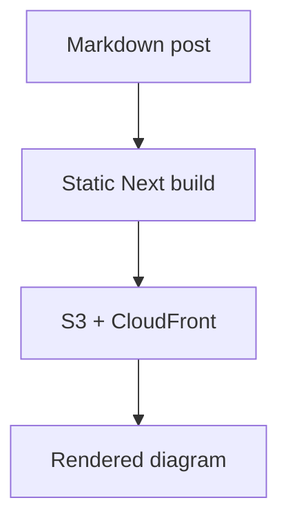

# Portfolio

This is a static [Next.js](https://nextjs.org/) portfolio site. Blog/project posts live in `posts/` as Markdown files and deploy to AWS S3 + CloudFront through GitHub Actions.

## Getting Started

First, run the development server:

```bash
npm run dev
```

Open [http://localhost:3000](http://localhost:3000) with your browser to see the result.

## Post Drafts

Add `draft: true` to a post's front matter to keep it out of generated list pages, pagination, and post routes:

```md
---
title: 'Work in Progress'
date: '2026-04-19'
draft: true
---
```

Remove the flag or set `draft: false` when the post is ready to publish.

## Image Assets

Use `content-assets/` as a local staging folder for portfolio images and other post media. The folder exists in git, but its media files are ignored so large assets do not get committed.

Add files locally:

```bash
cp ~/Desktop/project-screenshot.webp content-assets/project-screenshot.webp
```

Upload them to the content S3 bucket:

```bash
npm run assets:upload
```

The upload script preprocesses images into `.content-assets-processed/` before syncing them to S3. Processed files keep the same relative path and extension, so Markdown references stay stable while uploaded objects are resized and compressed.

Defaults:

- Max width: `612px`
- Quality for JPEG/WebP/AVIF/TIFF: `82`
- PNGs: lossless compression
- Output cache: `.content-assets-processed/.manifest.json`

The cache manifest is keyed by source file contents and processing settings, so unchanged images are reused instead of reprocessed on every upload.

To preprocess without uploading:

```bash
npm run assets:process
```

The upload script uses `AWS_PROFILE=deploy` by default, syncs to `s3://gentrydemchak-portfolio-content/`, makes uploaded objects publicly readable, and prints Markdown references plus their public URLs.

In posts, prefer referencing the local content asset path:

```md
---
image: 'content-assets/project-screenshot.webp'
---


```

At build time, `content-assets/project-screenshot.webp` is emitted as `https://gentrydemchak-portfolio-content.s3.amazonaws.com/project-screenshot.webp`.

Prefer new filenames when replacing images, for example `project-screenshot-v2.webp`, because uploaded assets use long-lived browser caching.

You can override the defaults when needed:

```bash
AWS_PROFILE=deploy ASSET_BUCKET=gentrydemchak-portfolio-content ASSET_MAX_WIDTH=2000 ASSET_QUALITY=88 npm run assets:upload
```

## Mermaid Diagrams

Posts can render Mermaid diagrams from fenced code blocks:

````md

````

Mermaid rendering runs in the browser only on post pages that include a Mermaid block.
