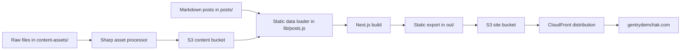
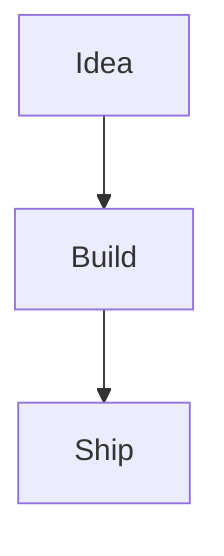

## What this site is

This portfolio is a static Next.js site. It uses the Pages Router, exports prebuilt HTML with `output: 'export'`, and keeps `trailingSlash: true` so the generated files work cleanly from object storage and a CDN.

The site itself is intentionally small: markdown files are the content system, React components handle the shared layout, and the build produces a static `out/` directory. There is no application server in production.



## Content model

Each post lives in `posts/` as a markdown file with front matter. The loader in `lib/posts.js` reads those files with `gray-matter`, normalizes the metadata, converts markdown to HTML with the unified/remark/rehype pipeline, highlights code blocks, and resolves local asset references.

Front matter supports:

```yaml
title: 'My Portfolio Site'
date: '2026-04-19'
description: 'How this static Next.js portfolio is authored, built, paginated, and deployed on AWS.'
tags: 'Next.js, React, AWS, Static Site'
author: 'Gentry Demchak'
image: 'content-assets/profile.jpg'
draft: false
```

The `description` field appears on post cards, so the listing pages can show a short summary before the reader opens the full article. `tags` can be written as a comma-separated string or a YAML array. `draft: true` keeps a post out of the generated listing pages and static post routes.

## Pagination

The post list is paginated at build time. `lib/posts.js` defines a shared page size, sorts posts by date, filters drafts, and returns only the current slice plus navigation metadata.

The homepage renders page 1 at `/`. Additional pages are generated from `pages/page/[page].js`, so the second page lives at `/page/2/`, the third at `/page/3/`, and so on. This keeps pagination fast and CDN-friendly because every page is just static HTML.

## Images and media

Image authoring uses a two-bucket model:

- The site bucket stores the generated static site.
- The content bucket stores public media such as post images.

Raw image assets go in `content-assets/`, which is gitignored so large originals do not bloat the repository. The asset script reads those files, resizes images to the layout width of 612px with `sharp`, writes the processed output into `.content-assets-processed/`, and uploads the results to the content S3 bucket.

The script keeps a manifest keyed by the source file, path, and processing settings. If an image has already been processed with the same settings, it is reused instead of processed again.

The workflow is:

```bash
npm run assets:process
npm run assets:upload
```

Markdown can reference assets with a local-looking path:

```markdown

```

During the build, `lib/asset-urls.mjs` rewrites that reference to the public S3 URL for the content bucket.

## Rich embeds

Posts can include Mermaid diagrams through fenced code blocks:

````markdown

````

The markdown renderer preserves the diagram source, and the client-side `MarkdownContent` component loads Mermaid only when a post page actually needs it.

X/Twitter embeds are also supported. A post can include the blockquote embed code from X, and the shared app wrapper loads the widget script so it is upgraded into the live embed in the browser.

## Deployment

Deployment runs from GitHub Actions when changes land on `main`, or when the workflow is manually dispatched.

The pipeline:

1. Checks out the repository.
2. Uses the Node version from `.nvmrc`.
3. Installs dependencies with `npm ci`.
4. Runs `npm run lint`.
5. Runs `npm run build` to create the static export.
6. Syncs `out/` to the private S3 site bucket.
7. Gives immutable cache headers to `_next/static/` assets.
8. Gives revalidation-friendly cache headers to pages and other mutable files.
9. Invalidates CloudFront so new pages are visible quickly.

AWS access uses GitHub's OpenID Connect flow instead of a long-lived access key. GitHub assumes a dedicated deploy role for this repository, and that role is scoped to the portfolio site bucket plus CloudFront invalidation for the portfolio distribution.

Production traffic flows through CloudFront. The DNS records for `gentrydemchak.com` and `www.gentrydemchak.com` point at the CloudFront distribution, and CloudFront reads the static files from the S3 site bucket through origin access control.

## Why this shape works

This setup keeps the site cheap, fast, and easy to maintain. The writing workflow is just markdown, the build output is static, images are optimized before upload, and deployment does not require a running server. CloudFront handles global delivery, S3 stores the files, and GitHub Actions keeps the release path repeatable.
