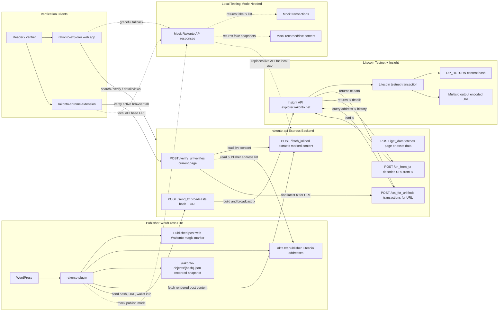

This is a wordpress plugin that records post and edit timestamps to the litecoin blockchain, providing a verifiable and immutable chain of edits.

This was a side project I helped develop during my time at Edelman Digital in collaboration with the technology director. 

I contributed mainly to the transaction explorer.

*explorer*

*transaction*

View the plugin repo [Rakonto](https://github.com/rakonto)

*Plugin architecture*

Contributors: [jtgrassie](https://github.com/jtgrassie) [deli-llama](https://github.com/deli-llama) [deevolutionism](https://github.com/deevolutionism) [philgomes](https://github.com/philgomes) [rakonteer](https://github.com/rakonteer)
